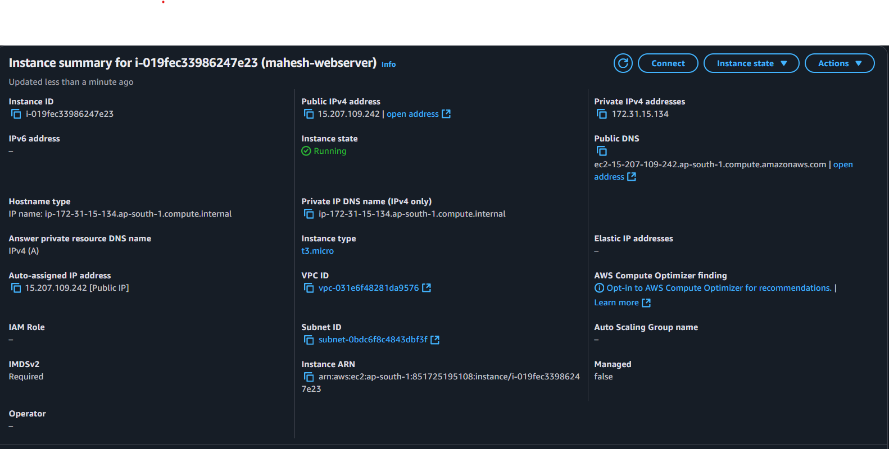
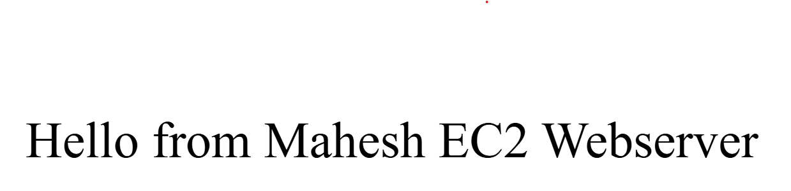
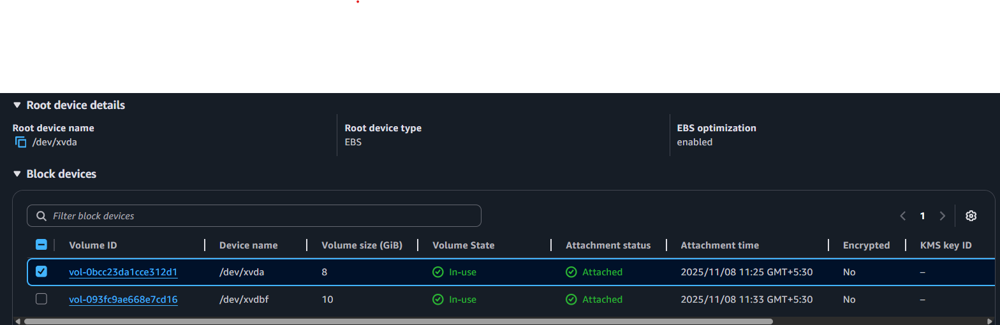
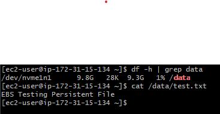
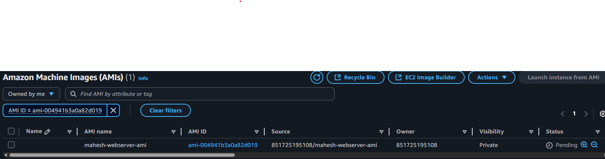
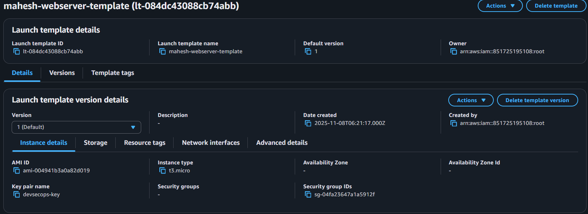
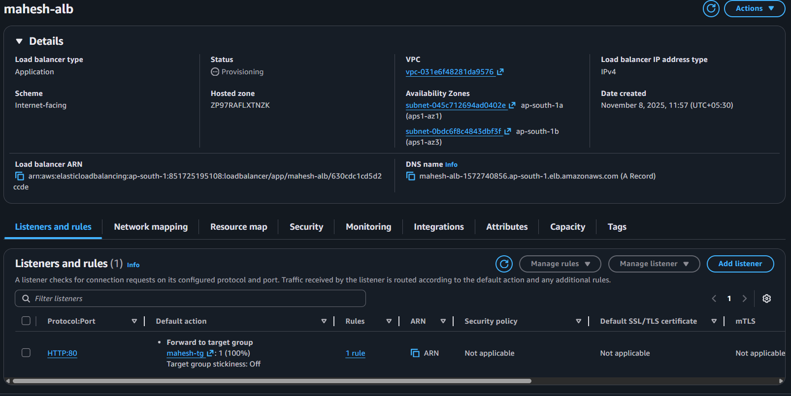
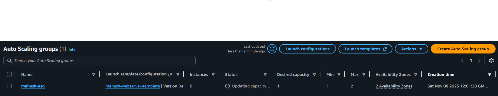
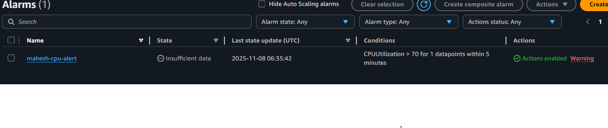
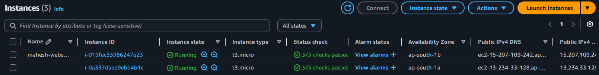

# 🟠 AWS Day 3 Hands-On Project: Scaling + Monitoring

This project demonstrates a **fully scalable, monitored web server setup** on AWS using EC2, EBS, AMI, Auto Scaling Groups, ALB, and CloudWatch.

---

## 🗂️ Steps & Screenshots

### 1️⃣ EC2 Launch
- **Goal:** Launch Amazon Linux EC2 and set up Apache web server
- **Screenshot:** 
- **Result:** Web server running, accessible via browser

### 2️⃣ Web Server Test
- **Goal:** Confirm Apache serves content
- **Screenshot:** 
- **Result:** "Hello from Mahesh EC2 Webserver" displayed

### 3️⃣ Attach & Mount EBS
- **Goal:** Add persistent storage
- **Screenshot:** 
- **Persistent Check:** 

### 4️⃣ Create Custom AMI
- **Goal:** Reusable image with Apache + EBS mounted
- **Screenshot:** 

### 5️⃣ Launch Template
- **Goal:** Template for Auto Scaling instances
- **Screenshot:** 

### 6️⃣ ALB + Target Group
- **Goal:** Distribute traffic & health checks
- **Screenshot:** 

### 7️⃣ Auto Scaling Group
- **Goal:** Automatic instance scaling
- **Screenshot:** 

### 8️⃣ CloudWatch Alarm
- **Goal:** Trigger alert when CPU > 70%
- **Screenshot:** 

### 9️⃣ Test Load Balancer + Scaling
- **Goal:** Verify load balancing across instances
- **Screenshot:** 
- **Note:** 2 instances auto-launched under load

---

## 🧠 Key Learnings

- **EBS vs Instance Store:** Persistent vs temporary storage  
- **Auto Scaling + ALB:** Auto-healing & traffic distribution  
- **CloudWatch + SNS:** Monitoring & alerting  
- **Launch Template & AMI:** Reusable EC2 configurations  

---

## ✅ Future Enhancements

- Capture Auto Scaling scale-out screenshot
- Capture SNS alert email screenshot
- Install CloudWatch Agent for memory/disk metrics
